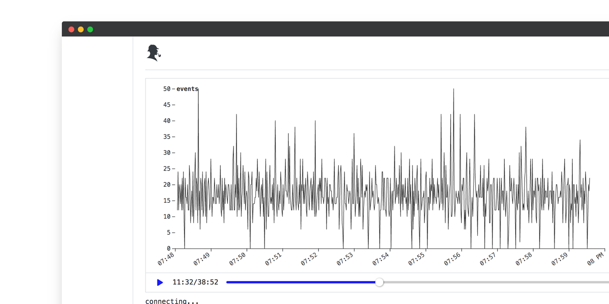

<p align="center">
    <a href="https://travis-ci.com/sherl0g/cli">
        
    </a>
    <a href="https://www.npmjs.com/package/@sherlog/cli">
        
    </a>
    <a href="https://www.npmjs.com/package/@sherlog/cli">
        
    </a>
    <a href="https://github.com/sherl0g/cli/blob/main/LICENSE">
        
    </a>
</p>

# @sherlog/cli
> Unified logs as stream.

>Sherlog CLI is bundled with [Prisma](https://github.com/sherl0g/prisma). Feel free to consume the stream with any other tool or programming language of your preference.

<p align="center">
  <br>
  
  <br>
  <br>
</p>


## Installation

OS X & Linux `node >= v8.12.0`:

```sh
npm install -g @sherlog/cli
```


## Usage

You can use the --help option to get more details about options and commands

```sh
Usage: sherlog [options] [command]

Options:
  -v, --version    print version
  -h, --help       display help for command

Commands:
  init [options]   initializes the project
  test [options]   validate your config schema
  start [options]  start the server
  help [command]   display help for command
```
## Getting started

The following command will initialize your project and create a basic `.sherlog` config file.
```sh
sherlog init
```
```json
{
  "hostname": "",
  "files": [
    {
      "metric": "",
      "file": "",
      "timezone": ""
    }
  ]
}
```
## Config parameters

* `hostname`:  default to your server hostname.
* `backpressure`: the interval in milliseconds between each websocket message sent (default: `1000`).
* `chunks`: max items stored in buffer for each metric chunk (default: `1`).
* `compression`: uses [pako](https://github.com/nodeca/pako) to compress messages sent over to [Prisma](https://github.com/sherl0g/prisma). Set to `false` if you wish to consume the stream with a different tool  (default: `true`).
* `files`: an array of services to monitor. The following options can be configured for each file.
  * `metric`: supported metrics `apache2|monolog|mysql|nginx|php-fpm|redis`
  * `file`: the absolute path to your log file.
  * `eventType`: apache2 and/or nginx requires this property to be set to one of the following `http|error`.
  * `timezone`: IANA time zone in which your logs are stored (e.g UTC, America/New York, etc),
  * `fromBeginning`: set to true if you wish to read files from the beginning  (default: `false`).


## Config example

```json
{
  "hostname": "192.168.10.1",
  "backpressure": 1000,
  "chunks": 500,
  "compression": true,
  "files": [{
    "metric": "nginx",
    "file": "path/to/nginx/access.log",
    "eventType": "http",
    "timezone": "UTC",
    "fromBeginning": true
  },
    {
      "metric": "nginx",
      "file": "path/to/nginx/error.log",
      "eventType": "error",
      "timezone": "UTC",
      "fromBeginning": false
    }]
}
```


## Development setup

```sh
npm install
npm run dev
npm run docker:build
npm test
```

## Meta

Bruce Lampson – [@Brucelampson](https://twitter.com/Brucelampson)

Distributed under the MIT License. See `LICENSE` for more information.

[https://github.com/BruceLampson](https://github.com/BruceLampson)

## Contributing

1. Fork it
2. Create your feature branch (`git checkout -b feature/fooBar`)
3. Commit your changes (`git commit -am 'Add some fooBar'`)
4. Push to the branch (`git push origin feature/fooBar`)
5. Create a new Pull Request
